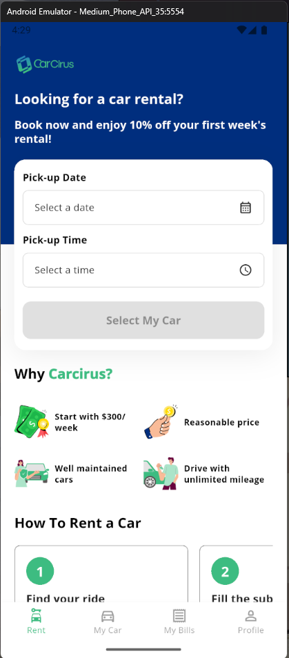
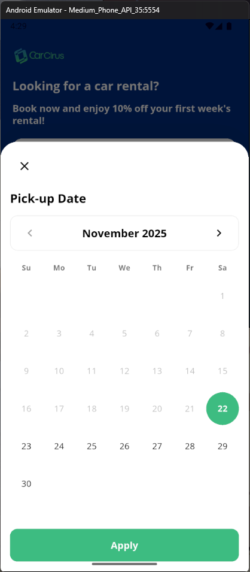
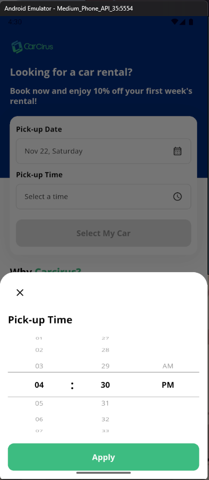
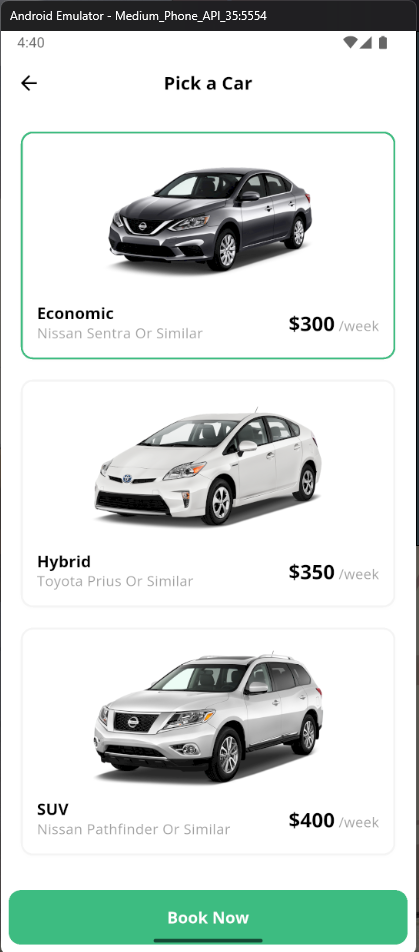
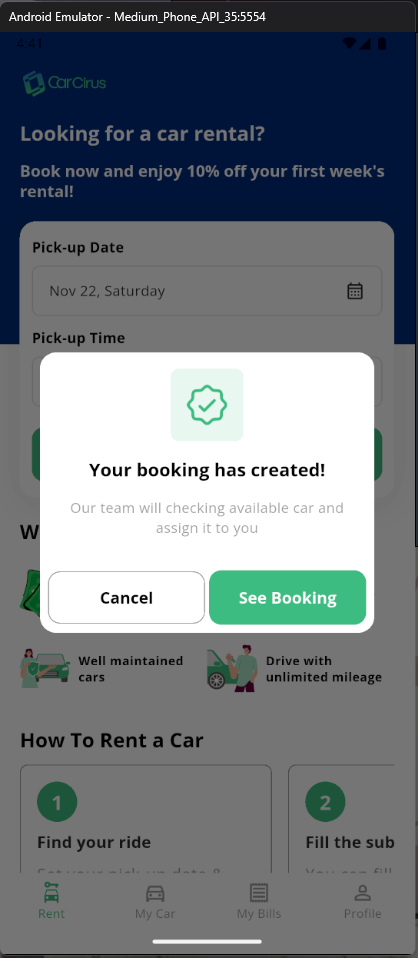
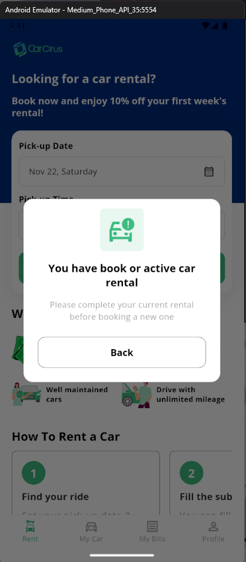

# Carcirus - Car Rental App

A modern, feature-rich car rental mobile application built with Flutter. Carcirus provides a seamless experience for users to browse available cars, select pickup dates and times, and complete bookings with an intuitive interface.

## 🎥 Demo

[App Demo Video](https://drive.google.com/file/d/1upQvsR7AIk-c2ATvtdONFrXU7cfxX-sI/view?usp=sharing)

## 📱 Screenshots

<p align="center">
  
  
  
</p>

<p align="center">
  
  
  
</p>

## ✨ Features

- **📅 Date & Time Selection**: Custom date and time pickers with an elegant modal interface
- **🚗 Car Browsing**: Browse through a curated list of available rental cars
- **📝 Booking System**: Complete booking flow with confirmation dialogs
- **🎨 Modern UI**: Clean and intuitive design with custom color scheme
- **📱 Responsive Layout**: Optimized for various screen sizes
- **🔄 State Management**: Global state management using Riverpod for bookings
- **🌐 Bottom Navigation**: Easy navigation between Rent, My Car, My Bills, and Profile sections

## 🎨 Design Features

- **Primary Color**: `#3DBC81` (Green) - Used for primary actions and highlights
- **Secondary Color**: `#0A307E` (Navy Blue) - Used for headers and secondary elements
- **Custom Typography**: OpenSans font family (Regular & Italic)
- **Material Design 3**: Modern Flutter Material Design implementation

## 🏗️ Project Structure

```
lib/
├── main.dart                      # App entry point with ProviderScope
├── theme.dart                     # Theme configuration and colors
├── data/
│   └── car_data.dart             # Sample car data
├── models/
│   ├── booking_model.dart        # Booking data model
│   └── car_model.dart            # Car data model
├── providers/
│   └── booking_provider.dart     # Riverpod state management for bookings
├── screens/
│   ├── home_screen.dart          # Main landing screen
│   └── car_selection_screen.dart # Car listing and selection
├── widgets/
│   ├── book_car_container.dart   # Booking form container
│   ├── car_card.dart             # Car display card
│   ├── custom_input_field.dart   # Reusable input field
│   ├── custom_date_picker.dart   # Custom date picker widget
│   ├── modal_date_picker.dart    # Modal date picker
│   ├── time_picker.dart          # Custom time picker widget
│   ├── modal_time_picker.dart    # Modal time picker
│   └── feature_card.dart         # Feature display card
└── utils/
    └── date_time_formatter.dart  # Date/time formatting utilities
```

## 🛠️ Tech Stack

- **Framework**: Flutter SDK ^3.8.1
- **Language**: Dart
- **State Management**: Riverpod ^2.6.1
- **UI Components**: Material Design 3
- **Asset Management**: flutter_gen
- **Code Generation**: build_runner

## 📦 Dependencies

```yaml
dependencies:
  flutter:
    sdk: flutter
  cupertino_icons: ^1.0.8
  intl: ^0.19.0                    # Date/time formatting
  flutter_picker_plus: ^1.5.4      # Custom picker widgets
  flutter_riverpod: ^2.6.1         # State management

dev_dependencies:
  flutter_test:
    sdk: flutter
  flutter_lints: ^5.0.0
  flutter_gen_runner: ^5.12.0      # Asset code generation
  build_runner: ^2.4.13
```

## 🚀 Getting Started

### Prerequisites

- Flutter SDK (^3.8.1 or higher)
- Dart SDK
- Android Studio / VS Code
- iOS Simulator (for Mac) or Android Emulator

### Installation

1. **Clone the repository**

   ```bash
   git clone <repository-url>
   cd carcirus_homepage
   ```
2. **Install dependencies**

   ```bash
   flutter pub get
   ```
3. **Generate assets**

   ```bash
   flutter pub run build_runner build
   ```
4. **Run the app**

   ```bash
   flutter run
   ```

### Build for Production

**Android APK**

```bash
flutter build apk --release
```

**iOS**

```bash
flutter build ios --release
```

## 🎯 Key Components

### State Management with Riverpod
Global booking state managed through Riverpod provider:
```dart
// Reading the current booking
final currentBooking = ref.watch(bookingProvider);

// Creating a new booking
ref.read(bookingProvider.notifier).createBooking(booking);

// Clearing the booking
ref.read(bookingProvider.notifier).clearBooking();
```

### Custom Input Field

Reusable input field component with label, value display, suffix icon, and tap handling:

```dart
CustomInputField(
  label: "Pick-up Date",
  value: "Aug 27, Thursday",
  suffixIcon: Icons.calendar_month_outlined,
  onTap: () => showDatePicker(),
)
```

### Date & Time Pickers

Custom modal pickers built with `flutter_picker_plus`:

- **Date Picker**: Calendar-style date selection with month/year navigation
- **Time Picker**: 12-hour format with AM/PM selection

### Car Card

Displays car information with image, name, and specifications:

- Car image with rounded corners
- Car name and category
- Transmission type and seating capacity
- Pricing information

## 📝 Features in Detail

### Home Screen

- Welcome header with company logo
- Promotional banner with discount information
- Date and time selection for pickup
- Quick access to car selection

### Car Selection

- Grid/list view of available cars
- Filter by car type, price, or features
- Detailed car information cards
- Direct booking action

### Booking Flow

1. Select pickup date and time
2. Choose preferred car
3. Review booking details
4. Confirm booking
5. Success confirmation dialog

## 🎨 Customization

### Colors

Update colors in `lib/theme.dart`:

```dart
class AppColors {
  static const Color primary = Color(0xFF3DBC81);
  static const Color secondary = Color(0xFF0A307E);
  // Add more colors as needed
}
```

### Typography

Modify fonts in `pubspec.yaml` and `lib/theme.dart`:

```yaml
fonts:
  - family: OpenSans
    fonts:
      - asset: lib/assets/fonts/OpenSans-Regular.ttf
      - asset: lib/assets/fonts/OpenSans-Italic.ttf
        style: italic
```

## 🔧 Development

### Running Tests

```bash
flutter test
```

### Code Generation

When adding new assets, run:

```bash
flutter pub run build_runner build --delete-conflicting-outputs
```

### Linting

```bash
flutter analyze
```

## 📄 License

This project is licensed under the MIT License - see the LICENSE file for details.

## 👥 Contributing

Contributions are welcome! Please feel free to submit a Pull Request.

## 📧 Contact

For any queries or support, please reach out to the development team.

---

**Built with ❤️ using Flutter**
